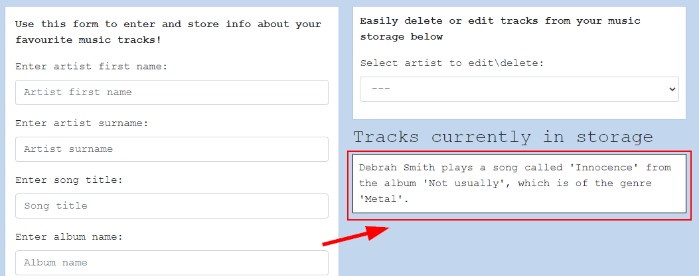
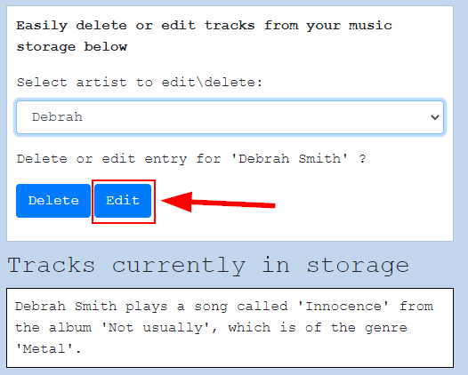
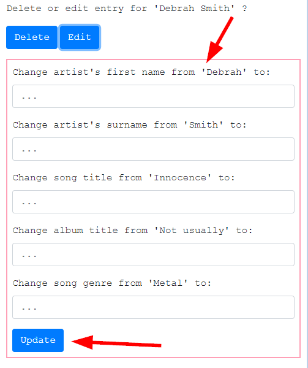
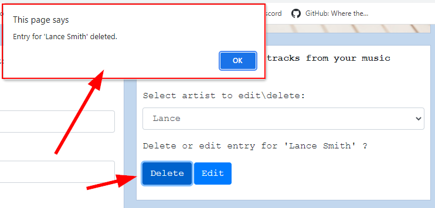
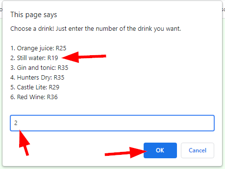
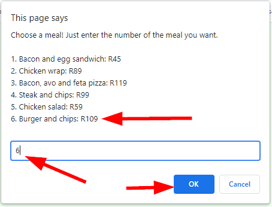
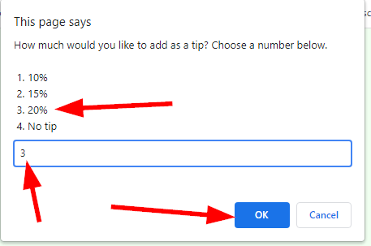
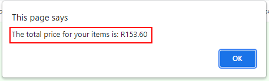

# HyperionDev Full Stack Web Development Bootcamp - Level 1 - Task 13 - JSON

## Description
This task was about using the web storage API and JSON to create 2 small websites. The 1st allows you to store, edit or delete music tracks, while the 2nd is a cafe bill calculator.

**JSON, or JavaScript Object Notation**, is a syntax for converting objects, arrays, numbers, strings, booleans into a format that can be transferred between the web server and the client. Like XML, JSON is language independent.

The **Web Storage API** stores data using key value pairs. This mechanism of storing data has to a large extent replaced the use of cookies for storing data about the current user's interaction with the website. 

The Web Storage API allows us to store state information in two ways:
1. sessionStorage stores state information for each given origin for as long as the browser is open.
2. localStorage stores state information for each given origin even when the browser is closed and reopened.

## Table of Contents
* [Instructions](#instructions)
* [Technologies](#technologies)
* [Installation](#installation)
* [Usage](#usage)
* [Credits](#credits) 

## Instructions
There were 2 parts to this task. These were the instructions I was given to guide me:

**Compulsory Task 1 - Music storage website**
Follow these steps:
* Create a webpage that can be used to let a user store information about a catalogue of music.
    * The user should be able to add information (e.g. artist, title, album, genre etc) about their favourite tracks.
    * All the information about all the tracks added by the user should be listed on the webpage.
    * The user should also be able to remove or edit information for a track.

**Compulsory Task 2 - Cafe bill calculator**
Follow these steps:
* Create a basic HTML file.
* You are required to create a cafe bill calculator with the following specifications:
    * Create a drinks object for drink items on the menu (create at least 5 options and give them prices as values)
    * Create a food object for food items on the menu (create at least 5 options and give them prices as values
    * Using a prompt box, display the drink items and let the user enter an option (add the price to a total)
    * Using a prompt box, display the food items and let the user enter an option (add the price to a total)
    * Using a prompt box, ask the user how much they want to tip (add this to the total)
    * Finally, create an alert to display the total of the bill to the user

### Technologies
This project uses:
* HTML 5 
* CSS 3
* Javascript ECMAScript 2021
* JSON and Web Storage API

## Installation
This project was created mainly using HTML, CSS and Javascript, so it needs no special installation. Simply open the index.html file for each of the 2 tasks in your browser and enjoy.

## Usage 
**Task 1 - Music storage website**
Try out this music storage website by filling in the details of your favourite music tracks. See figure 1 below.

Once you have filled the info in to the boxes, click on the "Store Info" button to save your track. See figure 2 below.

You will see that your track info has been stored and is being displayed on the right side of the page. See figure 3 below.

If you want to edit a track that you have stored, click on the dropdown menu above where the tracks are displayed and choose the name of the track you want to edit. See figure 4 below.

Then click on the "Edit" button. See figure 5 below.

You will now see that you can edit/replace any of the information you had previously saved for this specific track. Fill in the info you wish to change, if any, and then click on the "Update" button when you are satisfied. See figure 6 below.

If you want to delete a track that you have saved, click on the dropdown menu as before and choose the name of the artist. See figure 7 below.

Then click on the "Delete" button to delete the track. You will see a small popup window that lets you know that the track has been delete successfully. See figure 8 below.

**Task 2 - Cafe bill calculator**
Try out this Cafe bill calculator by first choosing a drink from the popup menu window. You choose by typing in the number corresponding to the drink you would like to order (e.g. 1 or 2 etc) and clicking the "Ok" button. See figure 9 below.

Then choose a meal in the same way (type a number and click "Ok"). See figure 10 below.

Choose how much of a tip you want to leave (e.g. 10%, 20% or none). See figure 11 below.

Finally, you are presented with your total bill amount. See figure 12 below.

## Credits
This project was created by Evan Malherbe as part of a task for HyperioDev Full Stack Development Bootcamp November 2021 [GitHub profile](https://github.com/evanmalherbe) 
